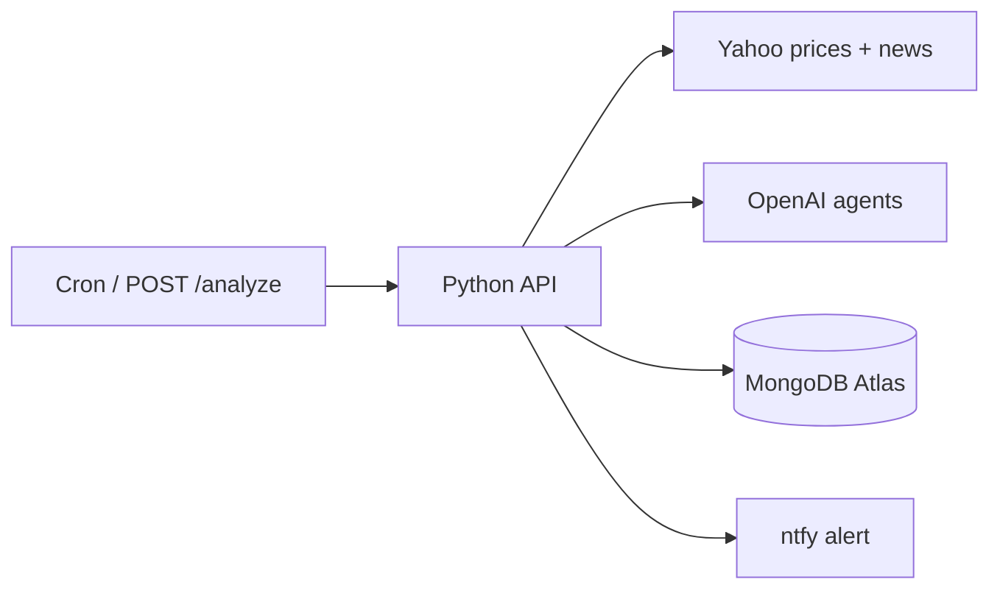

# Khabari — Hourly AI Stock Analyst

Production-oriented skeleton for an **hourly** AI stock analyst. Every hour, **n8n** fetches market data and news, a **Python FastAPI** service computes technical indicators, three LLM agents (News → Technical → Decision) produce **one** BUY/HOLD/SELL recommendation, risk rules cap position size, results land in **Postgres**, and a **Telegram** message is sent. You execute trades manually.

Starting capital: **$1,000**.

---

## Architecture



| Component | Role |
|-----------|------|
| **python-api** | Indicators, AI pipeline, risk rules, Mongo persistence |
| **MongoDB Atlas** | `prices`, `news`, `recommendations`, `portfolio`, `watchlist` |
| **n8n** | Optional scheduler UI (SQLite for its own state) |
| **ntfy** | Push notifications |

---

## Project structure

```
Khabari/
├── docker-compose.yml          # n8n + Postgres + Python API
├── .env.example                # API keys & credentials template
├── db/init.sql                 # Schema + seed watchlist / $1000 cash
├── data/portfolio.example.csv  # Sample portfolio mapping
├── n8n/workflows/              # Workflow guide + importable stub JSON
└── python-service/
    ├── Dockerfile
    ├── requirements.txt
    ├── app/
    │   ├── main.py             # FastAPI routes
    │   ├── indicators.py       # RSI, MACD, EMAs, BB, ATR, VWAP, ADX…
    │   ├── risk.py             # Max 30% position, 10% cash reserve
    │   ├── portfolio.py        # Excel/CSV → JSON
    │   ├── prompts.py          # News / Tech / Decision agent prompts
    │   ├── schemas.py
    │   └── config.py
    └── tests/
```

---

## Quick start

```bash
cp .env.example .env
# Edit .env — at minimum set N8N passwords; add OpenAI / Telegram / news keys when ready

docker compose up --build -d
```

| Service | URL |
|---------|-----|
| n8n UI | http://localhost:5678 |
| Python API docs | http://localhost:8000/docs |
| Postgres | `localhost:5432` (`stockdb`) |

Default n8n basic auth comes from `.env` (`N8N_BASIC_AUTH_USER` / `N8N_BASIC_AUTH_PASSWORD`).

### Smoke-test the Python API

```bash
curl -s http://localhost:8000/health
curl -s "http://localhost:8000/indicators?symbols=TSLA,NVDA" | jq .
curl -s http://localhost:8000/prompts | jq '.decision_agent.schema'
```

### Apply risk rules (example)

```bash
curl -s -X POST http://localhost:8000/risk/apply \
  -H 'Content-Type: application/json' \
  -d '{
    "recommendation": {
      "ticker": "NVDA", "action": "BUY", "investment": 400,
      "confidence": 85, "risk": "MEDIUM", "time_horizon": "SHORT",
      "expected_return": "5%", "reasoning": ["AI demand"]
    },
    "portfolio": {"cash": 1000, "positions": {}},
    "prices": {"NVDA": 120}
  }' | jq .
```

Expected: investment capped near **$255** (30% of portfolio × 85% confidence), with `remaining_cash` updated.

---

## Data model (Postgres)

Defined in [`db/init.sql`](db/init.sql):

- **prices** — OHLC + indicators, unique `(ticker, ts)`
- **news** — articles with `tickers[]`, `sentiment`, unique `uuid`
- **recommendations** — final BUY/SELL/HOLD JSON fields + reasoning
- **portfolio** — `cash` + `positions` JSONB snapshots
- **watchlist** — active tickers (seeded: TSLA, NVDA, AAPL, MSFT, AMZN)

Initial portfolio row: **$1000 cash**, empty positions.

### Excel / CSV column mapping

| Spreadsheet | JSON field |
|-------------|------------|
| Ticker | `positions.<TICKER>` |
| Shares | `positions.<TICKER>.shares` |
| AvgCost | `positions.<TICKER>.avg_cost` |
| Cash (optional) | `cash` |

Example file: [`data/portfolio.example.csv`](data/portfolio.example.csv).

Upload via API:

```bash
curl -F "file=@data/portfolio.example.csv" \
  "http://localhost:8000/portfolio/upload?cash=1000"
```

---

## AI agents

Prompt templates live in [`python-service/app/prompts.py`](python-service/app/prompts.py) and are exposed at `GET /prompts`.

| Agent | Job | Output |
|-------|-----|--------|
| **News** | Summarize headlines per ticker | `{ "TSLA": ["… (Bullish)"], … }` |
| **Technical** | Interpret RSI/MACD/EMAs | `{ "TSLA": "RSI 62…", … }` |
| **Decision** | One trade idea | Single recommendation JSON |

### Decision JSON schema

```json
{
  "ticker": "NVDA",
  "action": "BUY",
  "investment": 250,
  "confidence": 85,
  "risk": "MEDIUM",
  "time_horizon": "SHORT",
  "expected_return": "4-6%",
  "reasoning": ["Strong AI demand", "Bullish technicals"]
}
```

---

## Risk rules

Implemented in [`python-service/app/risk.py`](python-service/app/risk.py) / `POST /risk/apply`:

- Max **30%** of portfolio value per position
- Keep **≥10%** cash (invest ≤90% of cash)
- Size ∝ confidence (`investment × confidence/100` against caps)
- SELL with 0 shares → HOLD
- BUY under $1 after caps → HOLD

---

## n8n workflow

See [`n8n/workflows/README.md`](n8n/workflows/README.md) for the full node list.

1. Open http://localhost:5678
2. Import [`n8n/workflows/hourly-analyst.json`](n8n/workflows/hourly-analyst.json) (skeleton: Cron → Indicators → Risk → Telegram)
3. Add OpenAI nodes (News / Tech / Decision), news HTTP nodes, and Postgres inserts
4. Configure **OpenAI**, **Telegram**, and **Postgres** credentials

Telegram template (Markdown):

```
🚨 *AI Recommendation*

*BUY TSLA* – Invest $250
Confidence: 85%
Risk: Medium

*Reasons:*
• New EV model launch (Bullish)
• RSI 62 (Uptrend)

Remaining cash: $750
```

---

## Recommended APIs (v1)

| Need | Primary | Fallback |
|------|---------|----------|
| Prices / indicators | Python `yfinance` | Alpha Vantage, Finnhub |
| News | Marketaux | NewsData.io, Alpha Vantage News & Sentiment |
| Filings (optional) | SEC EDGAR JSON | — |
| LLM | OpenAI (`gpt-4o-mini` default) | — |
| Notify | Telegram Bot API | — |

Store all keys in `.env` / n8n credentials — never hardcode.

---

## Local Python tests (no Docker)

```bash
cd python-service
python -m venv .venv && source .venv/bin/activate
pip install -r requirements.txt pytest
pytest -q
```

---

## MVP roadmap

1. ✅ Docker Compose + schema + FastAPI skeleton  
2. ✅ `/indicators`, `/risk/apply`, `/portfolio/*`, `/prompts`  
3. ⬜ Finish n8n OpenAI + news + Postgres nodes  
4. ⬜ Wire Telegram end-to-end with live keys  
5. ⬜ Excel upload path in n8n  
6. ⬜ Error workflow + retries / rate-limit delays  

---

## Disclaimer

This system is for **educational / personal research** use. Recommendations are not financial advice. You place all trades manually and are responsible for your own risk.
