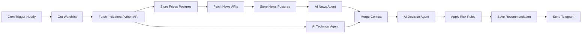

# n8n Workflow — Hourly AI Stock Analyst

Import this guide into n8n (UI) or recreate nodes from the JSON stub in `hourly-analyst.json`.

## Flow (Mermaid)



## Node checklist

| # | Node | Type | Purpose |
|---|------|------|---------|
| 1 | Cron | Schedule Trigger | `0 * * * *` (hourly, ET) |
| 2 | Watchlist | Set / Postgres | Static `TSLA,NVDA,AAPL,MSFT,AMZN` or `SELECT ticker FROM watchlist WHERE active` |
| 3 | Indicators | HTTP Request | `GET {{$env.PYTHON_API_URL}}/indicators?symbols=...` |
| 4 | Store Prices | Postgres | Upsert into `prices` |
| 5 | News Marketaux | HTTP Request | `GET https://api.marketaux.com/v1/news/all?symbols=...&api_token=...` |
| 6 | News AlphaV | HTTP Request | `NEWS_SENTIMENT` (optional parallel) |
| 7 | Store News | Postgres | Insert with `ON CONFLICT (uuid) DO NOTHING` |
| 8 | Build News Prompt | HTTP Request | `POST /prompts/news` |
| 9 | News Agent | OpenAI / HTTP | Chat completion with news system+user |
| 10 | Tech Prompt | HTTP Request | `POST /prompts/technical` |
| 11 | Tech Agent | OpenAI / HTTP | Chat completion |
| 12 | Merge | Code | Combine news + tech + portfolio |
| 13 | Decision Prompt | HTTP Request | `POST /prompts/decision` |
| 14 | Decision Agent | OpenAI / HTTP | Force JSON output |
| 15 | Risk Rules | HTTP Request | `POST /risk/apply` |
| 16 | Save Rec | Postgres | Insert `recommendations` |
| 17 | Telegram | Telegram | Markdown message |
| 18 | Error Handler | Error Trigger | Alert on failure |

## Telegram message template

```
🚨 *AI Recommendation*

*{{ $json.action }} {{ $json.ticker }}* – Invest ${{ $json.investment }}
Confidence: {{ $json.confidence }}%
Risk: {{ $json.risk }}

*Reasons:*
{{ $json.reasoning.map(r => '• ' + r).join('\\n') }}

Horizon: {{ $json.time_horizon }}
Expected: {{ $json.expected_return }}
Remaining cash: ${{ $json.remaining_cash }}
```

Set Telegram parse mode to **Markdown**.

## Env vars used inside n8n

- `PYTHON_API_URL` — default `http://python-api:8000` (set in docker-compose)
- Credentials: OpenAI, Telegram, Postgres (shared DB), Marketaux / Alpha Vantage keys

## Sample Indicators response

```json
{
  "indicators": {
    "TSLA": {
      "ticker": "TSLA",
      "price": 858.9,
      "rsi": 62.3,
      "macd": 1.2,
      "macd_signal": 0.8,
      "ema20": 850.4,
      "ema50": 840.1
    }
  },
  "errors": {}
}
```

## Sample Decision → Risk → Telegram payload

```json
{
  "ticker": "NVDA",
  "action": "BUY",
  "investment": 250,
  "confidence": 85,
  "risk": "MEDIUM",
  "time_horizon": "SHORT",
  "expected_return": "4-6%",
  "reasoning": ["Strong AI demand", "Bullish RSI/MACD"],
  "risk_adjusted": false,
  "remaining_cash": 750
}
```
